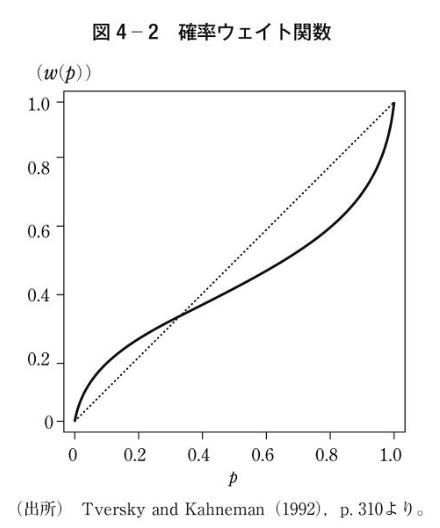

#　アレのパラドックスとプロスペクト理論

#何に関する資料か？

期待効用理論では、「個人は、くじの賞金の期待値の高い方を選ぶのではなく、クジの賞金から得る効用水準の期待値が高い方を選ぶ」とすることで、**個人のリスク回避に関する選好**も効用関数の形状のパラメタなどを通して説明しようとしている。

しかし、実験ではいくつか期待効用理論と矛盾している意思決定をする個人の例が出てきている。 
効用関数の形状に関わらず、効用水準の期待値が高い方を選んでいない被験者が多数を占めていたのである。

本資料では、このアレのパラドックスを説明し、それがどう説明付けられているのか？を備忘録として記述している。

## アレのパラドックス

アレは、2つの実験をした。1つは、

1. **確実に10億フランを得るクジ1**
2. **確率0.01で0フラン、確率0.1で50億フラン、確率0.89で10億フランを得るクジ2**  

のうちどちらかを被験者に選択させる実験。もう一つは  

3. **確率0.11で10億フラン、確率0.89で0フランを得るクジ3**
4. **確率0.10で50億フラン、確率0.9で0フランを得るクジ4**  

のうちどちらかを被験者に選択させる実験である。

それぞれのクジの期待値を考えると、（初期保有額はeとする。）
クジ|期待値（1億フラン)| 期待効用
:--:|:--:|:--:
1|10|
2|13.9|
3|1.1|
4|5|

実験結果では、クジ1,2を比べてどちらを引くかを被験者に聞くと多くの人がクジ1を選択し、クジ3,4を比べてどちらを引くかを被験者に聞くと多くの人がクジ4を選択するという。
これを、期待効用に基づいて表してみると、
&space;0.01&space;\times&space;u(0)&space;&plus;&space;0.1&space;\times&space;u(e&plus;50)&space;&plus;&space;0.89&space;\times&space;u(e&plus;10)" />
と表せる。

一方、２番目の実験結果は、

ここで、一番最初の式の両辺から,を引いてみると、

&space;0.01&space;\times&space;u(0)&space;&plus;&space;0.1&space;\times&space;u(e&plus;50)&space;&plus;&space;0.89&space;\times&space;u(e&plus;10)-&space;0.89&space;\times&space;u(e&plus;10)" />

となり、

&space;0.01&space;\times&space;u(0)&space;&plus;&space;0.1&space;\times&space;u(e&plus;50)"/>

と、初期保有額e及び、効用関数uにかかわらず、２番目の実験結果と矛盾してしまう。

この矛盾は、被験者が「実験２の方では期待値の高いクジ４を選んでいるのにも関わらず、実験１の方で、期待値の低い１を選んでいる」ことに起因する。

------
プロスペクト理論

参照点と意思決定ウェイト

主観的な確率pと客観的な確率w(p)が存在し、その二つの関係を次のように仮定する。

> 確実に何かいいことが起きるとわかっている時より、少しでもその事象が起きない可能性がある場合には、主観的な価値評価を大きく下げる。

> 確実に何かいいことが起きないとわかっている時より、少しでもその事象が起きる可能性がある場合には、主観的な価値評価を大きく上げる。

ここで、もういちどアレのパラドックスについて考えてみる。

> もしアレの実験における被験者が、客観的な期待値に基づいた計算ではなく、主観的な確率に基づいて最適なクジを選んでいたとしたらどうなるのか？

アレの実験では、

参考文献
- 行動経済学

